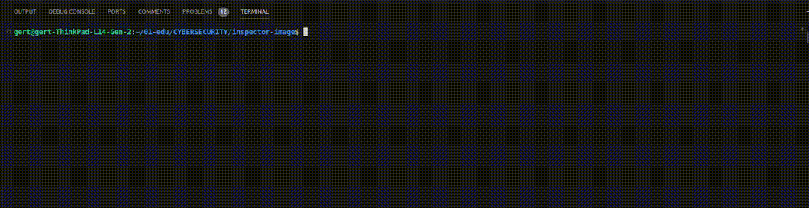

# inspector-image
The object of this project is to learn about a new method of passive analysis called [steganography](https://www.freecodecamp.org/news/what-is-steganography-hide-data-inside-data/).


# how to run:

clone the repository and run the following commands

```bash
cd inspector-image
pip install -r requirements.txt
```
then run the project with either -steg or -map flags followed by the image path
example:
```bash
python3 main.py --steg images/image.jpeg
```

audit questions can be found [here](https://github.com/01-edu/public/tree/master/subjects/cybersecurity/inspector-image/audit)



# questions for the author:
### Is the student able to explain clearly what steganography means?
* steganography is the practice of concealing information within another message or physical object to avoid detection. in the case of this project I am showcasing only one of many ways you can practice steganography, this one being images. Other forms of digital steganography include: Text, Video, Audio and Network.
### Is the student able to explain clearly how some information can be hidden in normal files?
* There are quite a few ways to hide information inside of an image. For example you can modify the binary of the image to have it contain information that is not visible without using a tool like "strings" on linux. Other ways to hide information inside of an image include: changing the image so it would show text when viewed with the right filer or by using a tool like "steghide" with a password to make it extra secure.

### Is the student able to explain clearly how his program works?
I have created a simple python script that will take in one of two flags:
* -map path/to/image       will take in an image path and print out the coordinates for where the image was taken by finding them in the image metadata.
* -steg path/to/image       will take in an image path and find the hidden key inside it. It does this by converting the image from binary to ascii and then by filtering the hidden key.


# author
[Gert Nõgene](https://github.com/GitGert)